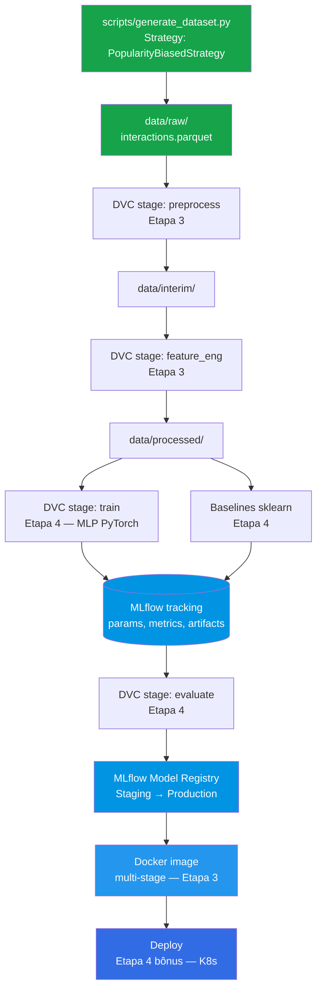
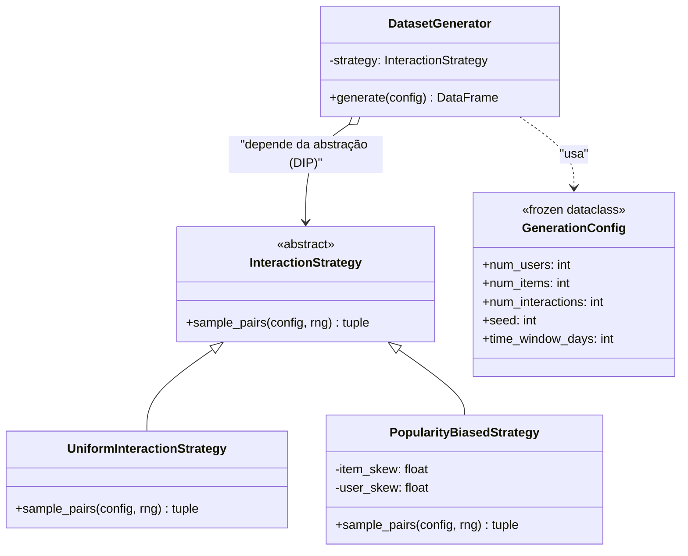

# Sistema de Recomendação E-commerce — Tech Challenge Fase 2 (Grupo 4)

[](https://www.python.org/)
[](https://pytorch.org/)
[](https://mlflow.org/)
[](https://dvc.org/)
[](https://scikit-learn.org/)
[](https://www.docker.com/)
[](https://python-poetry.org/)
[](https://docs.astral.sh/ruff/)
[](https://github.com/Janoti/mlet-tech-challenge-fase2/actions/workflows/ci.yml)
[](LICENSE)

Sistema de recomendação de produtos para e-commerce baseado no **comportamento de
navegação dos usuários**. O modelo central é uma rede neural (MLP ou embedding-based)
em PyTorch, com pipeline completo containerizado em Docker, dados versionados com DVC,
experimentos rastreados no MLflow e código seguindo padrões profissionais de Clean Code.

> **Status atual: Etapa 1 concluída.** As demais etapas serão implementadas
> incrementalmente — ver [§ 5 Roadmap](#5-roadmap).

## Arquitetura planejada



> Legenda: nós em verde já estão implementados (Etapa 1). Demais estão como
> placeholder e serão habilitados nas próximas etapas.

## Design pattern aplicado (Strategy)



## Status atual

- [x] Estrutura `src/`, `tests/`, `data/`, `models/`, `configs/`, `scripts/`, `docs/`
- [x] Design pattern **Strategy** aplicado no gerador de dataset
- [x] Pacote `recsys` com type hints + docstrings Google style em toda função pública
- [x] `pyproject.toml` com **Poetry** (deps prod/dev separadas)
- [x] **Ruff** configurado (lint + format) — regras `E, W, F, I, B, C90, N, UP, SIM, D, ANN`
- [x] **Pre-commit hooks** (ruff + higiene de arquivos + bloqueio de arquivos >500 kb)
- [x] **GitHub Actions CI** (jobs `lint` e `test` em paralelo, push/PR contra `main`)
- [x] Script reprodutível de geração de dataset sintético (seed fixa, schema inspirado no **RetailRocket**)
- [x] Suíte de testes cobrindo schema, reprodutibilidade, Strategy pattern e validação
- [x] Documentação inicial: `README.md` + `docs/etapa-01-resumo.md`
- [ ] Lock file `poetry.lock` commitado (Etapa 2)
- [ ] `Pydantic Settings` + `.env` real (Etapa 2)
- [ ] Script `scripts/validate_env.py` (Etapa 2)
- [ ] `Dockerfile` multi-stage + `docker-compose.yml` (Etapa 3)
- [ ] `dvc.yaml` com pipeline `preprocess → feature_eng → train → evaluate` (Etapa 3)
- [ ] MLflow tracking + Model Registry com promoção a Production (Etapas 3-4)
- [ ] Rede neural PyTorch (MLP / embedding) + comparação com baselines sklearn (Etapa 4)
- [ ] Model Card + vídeo STAR de 5 minutos (Etapa 4)
- [ ] Deploy bônus em nuvem (Kubernetes — alinhado com as aulas gravadas)

## Quick Start

> **Pré-requisitos:** Python 3.11+ e [Poetry](https://python-poetry.org/docs/#installation).

```bash
# 1. Clone o repositório
git clone https://github.com/Janoti/mlet-tech-challenge-fase2.git
cd mlet-tech-challenge-fase2

# 2. Instale as dependências (cria .venv automaticamente)
poetry install

# 3. Gere o dataset sintético reproduzível (50k interações, seed=42)
poetry run python scripts/generate_dataset.py

# 4. Rode os testes
poetry run pytest -v

# 5. Rode o linter
poetry run ruff check .
```

Saída esperada do passo 3:

```
... | INFO    | Configuração: GenerationConfig(num_users=2000, num_items=500, num_interactions=50000, seed=42, time_window_days=90)
... | INFO    | Dataset gerado: 50000 linhas em /…/data/raw/interactions.parquet
... | INFO    | Distribuição de tipos:
view            42531
add_to_cart      6004
purchase         1465
```

## Modos de execução

| Modo | Comando | Quando usar |
|---|---|---|
| **Gerar dataset (default)** | `poetry run python scripts/generate_dataset.py` | Recria o dataset sintético com seed 42 |
| **Gerar dataset customizado** | `NUM_INTERACTIONS=100000 poetry run python scripts/generate_dataset.py` | Trocar tamanho via env var (ver `.env.example`) |
| **Rodar testes** | `poetry run pytest -v` | Validar schema, reprodutibilidade e Strategy |
| **Rodar testes com cobertura** | `poetry run pytest --cov=recsys --cov-report=term-missing` | Análise de cobertura |
| **Lint** | `poetry run ruff check .` | Verificar qualidade do código |
| **Auto-format** | `poetry run ruff format .` | Corrigir formatação |
| **Pre-commit em todos os arquivos** | `poetry run pre-commit run --all-files` | Validar tudo antes de commitar |
| **Instalar pre-commit hooks localmente** | `poetry run pre-commit install` | Ativar checks automáticos no `git commit` |

## 1. Objetivo

- Construir um sistema de recomendação a partir de **interações user-item**
  (visualização, adição ao carrinho, compra).
- Treinar uma **rede neural** (MLP ou embedding-based) em PyTorch e compará-la
  com baselines sklearn em ≥ 4 métricas.
- Garantir **reprodutibilidade ponta-a-ponta**: seeds fixos, dataset versionado
  com DVC, pipeline `dvc repro` funcional, imagem Docker otimizada.
- Rastrear experimentos no **MLflow** (parâmetros, métricas, artefatos) e
  promover o melhor modelo a **Production** via Model Registry.

## 2. Pipeline e estrutura

A Etapa 1 entrega a fundação. O fluxo completo (a ser construído nas próximas
etapas) será orquestrado pelo DVC:

```text
data/raw/  →  preprocess  →  feature_eng  →  train (MLP)  →  evaluate
                                       ↘  train (baselines sklearn)  ↗
```

Cada estágio do DVC consumirá artefatos versionados do estágio anterior. Hoje,
apenas o nó-fonte (`data/raw/`) é populado, via `scripts/generate_dataset.py`.

## 3. Dataset

### 3.1 Base: RetailRocket E-commerce

O script `scripts/generate_dataset.py` gera **dados sintéticos** inspirados no
[**RetailRocket E-commerce dataset**](https://www.kaggle.com/datasets/retailrocket/ecommerce-dataset),
o mais aderente ao enunciado entre os três sugeridos (Instacart, RetailRocket,
MovieLens) por focar em **comportamento de navegação real** (não em ratings).

Mapeamento de schema (gerado ↔ RetailRocket original):

| Coluna gerada | Tipo | RetailRocket original | Equivalência |
|---|---|---|---|
| `user_id` | `int32` | `visitorid` | Identificador do usuário |
| `item_id` | `int32` | `itemid` | Identificador do produto |
| `interaction_type` | `str` | `event` | `view` / `add_to_cart` / `purchase` |
| `timestamp` | `datetime64[s]` | `timestamp` | Momento da interação (UTC) |

### 3.2 Características do dataset gerado

| Característica | Valor default | Configurável via |
|---|---|---|
| Número de usuários | 2.000 | `NUM_USERS` |
| Número de itens | 500 | `NUM_ITEMS` |
| Número de interações | 50.000 | `NUM_INTERACTIONS` |
| Janela temporal | 90 dias | (futuramente exposto) |
| Distribuição de tipos | 85 % view / 12 % add_to_cart / 3 % purchase | (constante) |
| Estratégia de amostragem | `PopularityBiasedStrategy` (Zipf) | injeção do construtor |
| Seed | 42 | `RANDOM_SEED` |

### 3.3 Por que sintético em vez de baixar o RetailRocket?

- **Reprodutibilidade total** — duas execuções com a mesma seed produzem
  exatamente o mesmo `parquet` (verificado em [test_generator.py:65](tests/data/test_generator.py#L65)).
- **Velocidade de avaliação** — o avaliador não precisa baixar ~300 MB do
  Kaggle: gera o dataset em segundos.
- **Foco didático** — concentra a complexidade no modelo, não no ETL do
  dataset real.
- **Substituível na Etapa 3** — o dataset será versionado pelo DVC. Trocar
  por RetailRocket real (ou MovieLens) é alterar apenas o stage `preprocess`,
  sem mexer no resto do pipeline.

## 4. Estrutura do repositório

```text
mlet-tech-challenge-fase2/
├── .github/workflows/
│   └── ci.yml                       # CI: lint (ruff) + test (pytest) em paralelo
├── configs/                         # YAMLs de configuração por etapa (Etapa 2+)
├── data/
│   ├── raw/                         # Dataset bruto (versionado via DVC na Etapa 3)
│   ├── interim/                     # Artefatos intermediários
│   └── processed/                   # Splits prontos para treino
├── docs/
│   └── etapa-01-resumo.md           # Resumo detalhado da Etapa 1
├── models/                          # Artefatos de modelo (MLflow Registry, Etapa 4)
├── notebooks/                       # Notebooks de exploração (não vão para runtime)
├── scripts/
│   └── generate_dataset.py          # Entrypoint CLI do gerador de dataset
├── src/recsys/
│   ├── __init__.py
│   ├── data/
│   │   ├── generator.py             # Strategy pattern + DatasetGenerator
│   │   └── schema.py                # InteractionType (StrEnum) + constantes
│   ├── models/                      # PyTorch + baselines (Etapas 3-4)
│   ├── preprocessing/               # Estratégias de pré-processamento (Etapa 3)
│   └── utils/
│       └── seed.py                  # set_global_seed centralizado
├── tests/
│   ├── __init__.py
│   └── data/
│       └── test_generator.py        # Schema · Reprodutibilidade · Strategy · Validação
├── .dockerignore                    # Pronto para Etapa 3 (Docker → K8s)
├── .env.example                     # Template de variáveis de ambiente
├── .gitignore
├── .pre-commit-config.yaml          # Hooks locais (ruff + higiene)
├── .python-version                  # 3.11
├── pyproject.toml                   # Poetry + ruff + pytest (única fonte da verdade)
└── README.md
```

## 5. Roadmap

| Etapa | Foco | Entregáveis | Status |
|---|---|---|---|
| **1** | Clean Code e Estrutura | Estrutura, design patterns, linting, CI, gerador de dataset | ✅ Concluída |
| **2** | Ambiente e Dependências | `poetry.lock`, `Pydantic Settings`, `.env`, `validate_env.py` | ⏳ Próxima |
| **3** | Containerização e Versionamento | `Dockerfile` multi-stage, `docker-compose`, `dvc init`, `dvc.yaml` (≥ 3 stages), MLflow tracking | ⏳ |
| **4** | Rede Neural, Registry e Entrega | MLP PyTorch, baselines sklearn (≥ 4 métricas), Model Registry → Production, Model Card, vídeo STAR | ⏳ |
| **Bônus** | Deploy em nuvem | Kubernetes (alinhado com as aulas gravadas) — URL pública acessível | ⏳ |

Detalhes da Etapa 1 em [docs/etapa-01-resumo.md](docs/etapa-01-resumo.md).

## 6. Ambiente e instalação

### 6.1 Pré-requisitos

- Python 3.11 (ver `.python-version`)
- Poetry 1.8+
- Git
- Docker Desktop (necessário a partir da Etapa 3)

### 6.2 Instalação

```bash
git clone https://github.com/Janoti/mlet-tech-challenge-fase2.git
cd mlet-tech-challenge-fase2

# Instala todas as deps (prod + dev) num .venv local
poetry install

# Ativa o hook de pre-commit (executa ruff antes de cada commit)
poetry run pre-commit install
```

### 6.3 Variáveis de ambiente

Copie `.env.example` para `.env` e ajuste se necessário:

```bash
cp .env.example .env
```

Variáveis disponíveis (resumo — ver `.env.example` para a lista completa):

| Variável | Default | Descrição |
|---|---|---|
| `RANDOM_SEED` | `42` | Semente global de reprodutibilidade |
| `NUM_USERS` | `2000` | Usuários distintos no dataset sintético |
| `NUM_ITEMS` | `500` | Itens distintos no catálogo simulado |
| `NUM_INTERACTIONS` | `50000` | Total de interações (≥ 10 000, requisito) |
| `DATA_RAW_DIR` | `data/raw` | Diretório de saída do gerador |
| `MLFLOW_TRACKING_URI` | `./mlruns` | Onde o MLflow grava as runs (Etapa 3) |
| `MLFLOW_EXPERIMENT_NAME` | `recsys-ecommerce` | Nome do experimento padrão |
| `LOG_LEVEL` | `INFO` | Verbosidade dos logs |

## 7. Geração dos dados

### 7.1 Uso padrão

```bash
poetry run python scripts/generate_dataset.py
```

Gera `data/raw/interactions.parquet` com 50.000 linhas, seed=42 e viés de popularidade
(`PopularityBiasedStrategy`).

### 7.2 Customização via env vars

```bash
NUM_INTERACTIONS=100000 NUM_USERS=5000 RANDOM_SEED=7 \
  poetry run python scripts/generate_dataset.py
```

### 7.3 Estratégia alternativa (uso programático)

Para gerar um dataset com distribuição uniforme (baseline ingênua, sem cauda longa):

```python
from recsys.data.generator import DatasetGenerator, GenerationConfig, UniformInteractionStrategy

config = GenerationConfig(num_users=2000, num_items=500, num_interactions=50_000, seed=42)
generator = DatasetGenerator(strategy=UniformInteractionStrategy())
df = generator.generate(config)
df.to_parquet("data/raw/interactions_uniform.parquet", index=False)
```

Adicionar uma nova estratégia (ex.: `TemporalDriftStrategy`) é apenas implementar
a interface `InteractionStrategy.sample_pairs(...)` — o `DatasetGenerator` não precisa
ser alterado (OCP).

## 8. Qualidade de código

### 8.1 Lint e formatação (Ruff)

```bash
poetry run ruff check .                  # apenas verifica
poetry run ruff check . --fix            # auto-fix do que for seguro
poetry run ruff format .                 # formata
poetry run ruff format . --check         # checa formatação (modo CI)
```

Regras ativas: `E, W, F, I, B, C90 (max-complexity=8), N, UP, SIM, D (Google), ANN`.

### 8.2 Testes (pytest)

```bash
poetry run pytest                                          # resumido + cobertura
poetry run pytest -v                                       # verbose
poetry run pytest tests/data/test_generator.py -v          # arquivo específico
poetry run pytest tests/data/test_generator.py::TestReproducibility -v
```

Suítes implementadas em `tests/data/test_generator.py`:

| Classe | Cobre |
|---|---|
| `TestSchema` | Colunas, contagem de linhas, ranges de IDs, tipos de interação válidos |
| `TestReproducibility` | Mesma seed ⇒ DataFrame idêntico; seeds diferentes ⇒ DataFrames diferentes |
| `TestStrategyPattern` | `PopularityBiasedStrategy` concentra interações mais do que `UniformInteractionStrategy` |
| `TestConfigValidation` | `GenerationConfig` rejeita inputs inválidos (`num_users < 0`, `num_interactions < 10_000`) |

### 8.3 Pre-commit (local)

```bash
poetry run pre-commit install            # ativa hooks no .git/hooks/
poetry run pre-commit run --all-files    # roda manualmente em tudo
```

Hooks ativos: ruff (lint+format), trailing-whitespace, end-of-file-fixer, check-yaml,
check-toml, check-added-large-files (≤ 500 kb), check-merge-conflict, detect-private-key.

### 8.4 Padrão de logs

O projeto **não usa `print()`** — toda saída diagnóstica passa pelo módulo
[`recsys.utils.logging_utils`](src/recsys/utils/logging_utils.py), idêntico em
estilo ao adotado na Fase 1 do grupo.

**Formato canônico:**

```
2026-05-10 18:49:41,339 | INFO | recsys.scripts.generate_dataset | dataset_written | path=data/raw/interactions.parquet rows=50000
```

Componentes: `timestamp | level | logger_name | event | key1=v1 key2=v2 …`.

**Como usar em código novo:**

```python
from recsys.utils.logging_utils import get_logger, log_kv, setup_logging

setup_logging()                      # apenas nos entrypoints (scripts/CLI)
logger = get_logger(__name__)        # em qualquer módulo

logger.info("training_started")
log_kv(logger, "epoch_finished", epoch=3, loss=0.42, lr=1e-3)
```

`setup_logging()` é **idempotente** — pode ser chamada várias vezes sem
duplicar handlers (importante em testes e notebooks).

**Controlar verbosidade:**

```bash
LOG_LEVEL=DEBUG poetry run python scripts/generate_dataset.py
LOG_LEVEL=WARNING poetry run pytest -v
```

Valores aceitos: `DEBUG`, `INFO` (default), `WARNING`, `ERROR`, `CRITICAL`.
Valor inválido cai silenciosamente em `INFO` — log nunca deve quebrar a app.

### 8.5 CI (GitHub Actions)

Definido em [.github/workflows/ci.yml](.github/workflows/ci.yml). Roda em todo push
e PR contra `main`:

- **Job `lint`** — `ruff check` + `ruff format --check` (segundos).
- **Job `test`** — `poetry install` + `pytest --cov=recsys`.

Cache do `.venv` reduz execuções subsequentes de ~3 min para ~30 s após o `poetry.lock`
ser commitado na Etapa 2.

## 9. Convenções

### 9.1 Branches e commits

- **Branch principal:** `main` (protegida — alterações via PR).
- **Branches de trabalho:** `feat/<descrição>`, `fix/<descrição>`, `chore/<descrição>`,
  `docs/<descrição>`, `refactor/<descrição>`, `test/<descrição>`.
- **Commits:** [Conventional Commits](https://www.conventionalcommits.org/).
  Exemplos:
  - `feat(etapa-01): bootstrap estrutura, clean code e design patterns`
  - `fix(generator): valida num_interactions >= 10_000 no __post_init__`
  - `docs(readme): adiciona mermaid da arquitetura planejada`

### 9.2 Estilo de código (Clean Code)

- **Funções ≤ 20 linhas** (regra do enunciado).
- **Complexidade ciclomática ≤ 8** (configurado no ruff `mccabe.max-complexity`).
- **Type hints obrigatórias** em todas as funções públicas.
- **Docstrings Google style** com `Args:`, `Returns:`, `Raises:`.
- **SOLID**: `S` (uma responsabilidade por classe), `O` (extensível via Strategy),
  `L` (subclasses intercambiáveis), `I` (interfaces pequenas), `D` (depender de abstrações).
- **Imutabilidade** onde fizer sentido (ex.: `GenerationConfig` é `@dataclass(frozen=True)`).
- **Constantes nomeadas** em vez de magic numbers/strings.

## 10. Documentação

- [docs/etapa-01-resumo.md](docs/etapa-01-resumo.md) — resumo da Etapa 1 com referência
  detalhada ao RetailRocket e princípios de Clean Code aplicados.

Documentação adicional será criada conforme as etapas avançam:

- `docs/etapa-02-resumo.md` (Poetry + lock + Pydantic Settings)
- `docs/etapa-03-resumo.md` (Docker + DVC + MLflow)
- `docs/etapa-04-resumo.md` (PyTorch + Registry + Model Card)
- `docs/model_card.md` (Model Card final, Etapa 4)

## 11. Próximos passos imediatos

1. Rodar `poetry install` para gerar e commitar o `poetry.lock`.
2. Abrir Pull Request: [feat/etapa-01-clean-code-estrutura → main](https://github.com/Janoti/mlet-tech-challenge-fase2/compare/main...feat/etapa-01-clean-code-estrutura).
3. Iniciar Etapa 2 — `Pydantic Settings` para externalizar config + `scripts/validate_env.py`.

## 12. Contato

Grupo 4 — Tech Challenge FIAP pós-tech (Machine Learning Engineering).
